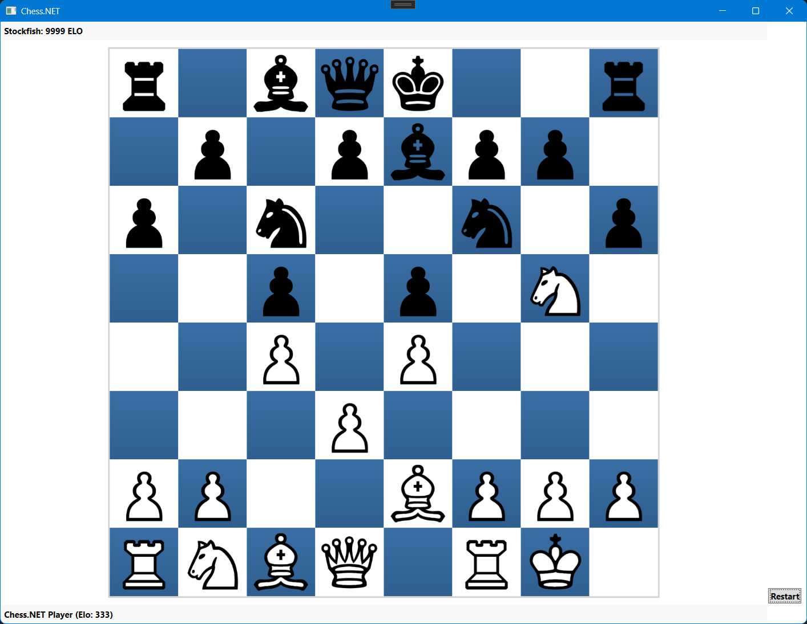

# Chess.NET

**Chess.NET** is a modern chess game in **C# / .NET 10**, built completely from scratch.  
It includes (almost) full game rules, a WPF-based GUI, custom bot logic, and even the ability to **play against Stockfish** via UCI.

> ⚠️ **ATTENTION**  This game isn't finished yet and it's still very rudimental!

### Missing Features
- Time Control

### Features
- Play against bots (e.g Stockfish oder Stupiod) or even online (if there are any other players)
- Drag & Drop pieces
- You can play puzzles (currently there are only two)
- Settings for your name, elo (Player 1 and Player 2) or bot settings (difficutly)
- GUI is localized in DE/EN
- (Almost) full chess rule implementations:
  - EN PASSANT!
  - Choose promotion!
  - Check, checkmate, stalemate, fifty-move rule and threefold repition implemented
  - **Castling (king-side & queen-side)** fully implemented
  - Illegal moves are reliably prevented

### Requirements
- `stockfish.exe` if you want to play against the engine!
